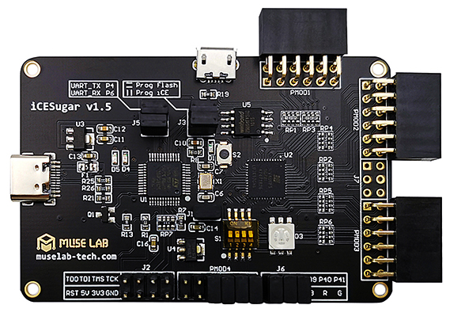

# ICESugar_v1.5
**iCESugar is a FPGA board made by MuseLab, which is base on Lattice iCE40UP5k**

* URL: [https://github.com/wuxx/icesugar](https://github.com/wuxx/icesugar)
* Toolchain: [icestorm](../../generator/toolchains/icestorm/README.md)
* Family: ice40
* Type: up5k
* Package: sg48
* Flashcmd: openFPGALoader -b ice40_generic rio.bin -f
* Clock: 12.000Mhz -> PLL -> 30.000Mhz (Pin:35)
* Example-Configs: [ICESugar_V1.5](../../configs/ICESugar_V1.5)

